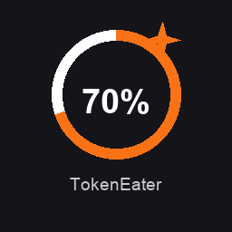

<p align="center">
  
</p>

<h1 align="center">TokenEater</h1>

<p align="center">
  <strong>Monitor your Claude AI usage limits directly from your macOS desktop.</strong>
</p>

<p align="center">
  
  
  
  
  
  
</p>

---

> **Requires a Claude Pro or Team plan.** The free plan does not expose usage data.

## What is TokenEater?

A native macOS widget + menu bar app that displays your Claude (Anthropic) usage in real-time:

- **Session (5h)** — Sliding window with countdown to reset
- **Weekly — All models** — Opus, Sonnet & Haiku combined
- **Weekly — Sonnet** — Dedicated Sonnet limit
- **Pacing** — Are you burning through your quota or cruising? Delta display with 3 zones (chill / on track / hot)

### Desktop Widgets

Three widget options:
- **Usage Medium** — Circular gauges for session, weekly, and pacing
- **Usage Large** — Progress bars with full details for all metrics
- **Pacing** — Dedicated small widget with circular gauge and ideal marker

### Menu Bar

Live usage percentages directly in your menu bar — choose which metrics to pin (session, weekly, sonnet, pacing). Click to see a detailed popover with progress bars, pacing delta, and quick actions.

Color-coded: green when you're comfortable, orange when usage climbs, red when approaching the limit.

### Notifications

Automatic alerts when usage crosses thresholds:
- **60%** — Warning to slow down
- **85%** — Critical usage alert
- **Reset** — Back in the green notification

### Authentication

**Claude Code OAuth** — Reads the OAuth token from Claude Code's Keychain entry. Zero configuration needed if you have Claude Code installed. Tokens refresh automatically.

### SOCKS5 Proxy

For users behind a corporate firewall, TokenEater supports routing API calls through a SOCKS5 proxy (e.g. `ssh -D 1080 user@bastion`).

- **Menu bar app** — Configure in Settings > Proxy
- **Desktop widgets** — Long-press a widget > Edit Widget to set proxy host/port

### Localization

Fully localized in **English** and **French**. The app automatically follows your macOS system language.

## Quick Install

### Homebrew (recommended)

```bash
brew tap AThevon/tokeneater
brew install --cask tokeneater
```

To update later: `brew upgrade tokeneater`

> **Already installed manually?** Switch to Homebrew for automatic updates:
> ```bash
> rm -rf /Applications/TokenEater.app
> brew tap AThevon/tokeneater
> brew install --cask tokeneater
> ```

### Manual Download

1. Go to [**Releases**](../../releases/latest) and download `TokenEater.dmg`
2. Open the DMG, drag `TokenEater.app` into `Applications`
3. **Important** — the app is not notarized by Apple. Before the first launch, run:
   ```bash
   xattr -cr /Applications/TokenEater.app
   ```
4. Open `TokenEater.app` from Applications

### Configure

**Prerequisites:** Install [Claude Code](https://docs.anthropic.com/en/docs/claude-code) and authenticate (`claude` then `/login`).

1. Open TokenEater, click **Connect** — the OAuth token is detected automatically
2. Right-click on desktop > **Edit Widgets** > search "TokenEater"

> Tokens refresh automatically via Claude Code. No maintenance needed.

## Build from source

### Requirements

- macOS 14 (Sonoma) or later
- Xcode 15+
- [XcodeGen](https://github.com/yonaskolb/XcodeGen): `brew install xcodegen`

### Steps

```bash
git clone https://github.com/AThevon/TokenEater.git
cd TokenEater

# Generate Xcode project
xcodegen generate

# ⚠️ XcodeGen strips NSExtension from the widget Info.plist.
# Re-add it manually or run:
plutil -insert NSExtension -json '{"NSExtensionPointIdentifier":"com.apple.widgetkit-extension"}' \
  ClaudeUsageWidget/Info.plist 2>/dev/null || true

# Build
xcodebuild -project ClaudeUsageWidget.xcodeproj \
  -scheme ClaudeUsageApp \
  -configuration Release \
  -derivedDataPath build build

# Install
cp -R "build/Build/Products/Release/TokenEater.app" /Applications/
killall NotificationCenter 2>/dev/null
open "/Applications/TokenEater.app"
```

## Architecture

```
ClaudeUsageApp/          App host (settings UI, OAuth auth, menu bar)
ClaudeUsageWidget/       Widget Extension (WidgetKit, 15-min refresh)
Shared/                  Shared code (API client, models, pacing, notifications)
  ├── en.lproj/          English strings
  └── fr.lproj/          French strings
project.yml              XcodeGen configuration
```

The host app and widget extension are both sandboxed. Each reads the OAuth token directly from the macOS Keychain ("Claude Code-credentials"). No shared storage or App Groups needed. The menu bar refreshes every 5 minutes independently.

## How it works

TokenEater reads the OAuth token from Claude Code's Keychain entry and calls:

```
GET https://api.anthropic.com/api/oauth/usage
Authorization: Bearer <token>
anthropic-beta: oauth-2025-04-20
```

The response includes `utilization` (0–100) and `resets_at` for each limit bucket. The widget refreshes every 15 minutes (WidgetKit minimum) and caches the last successful response for offline display.

## License

MIT — do whatever you want with it.
